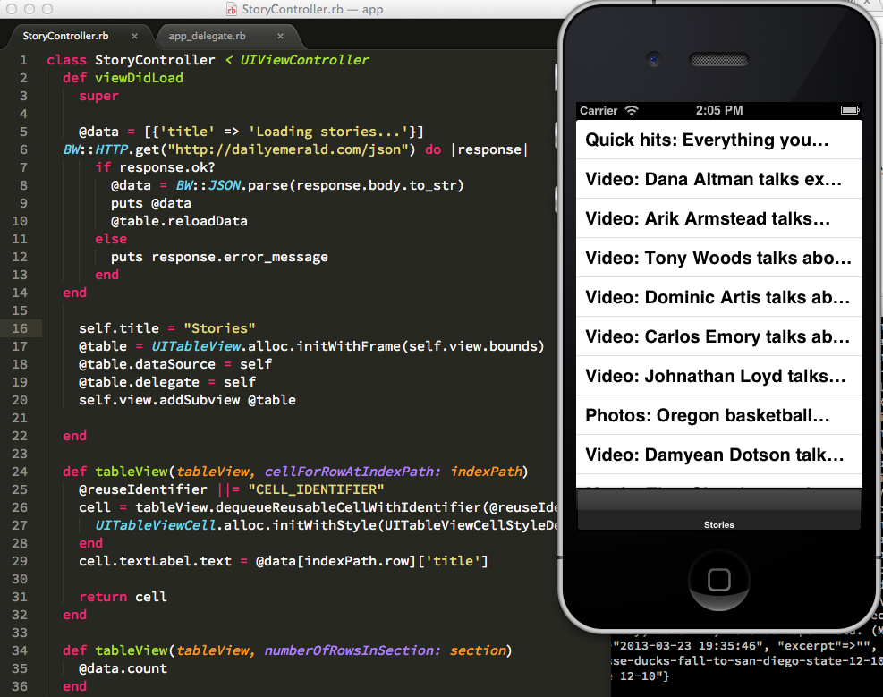

## My first hour with RubyMotion

I read the first few chapters of [rubymotion-tutorial.com](http://rubymotion-tutorial.com/5-tables/) and made a toy headline reader. I think I benefitted from [knowing my way around the "normal way"](https://github.com/dailyemerald/News-App/tree/develop/EmeraldNews). As nice as RubyMotion is, you can't get around view lifecycle/etc and another layer of abstraction is only convenient when you have some grasp of the underpinnings. Not that I'm even a half-decent Obj-C.

It downloads JSON from the Emerald's WordPress site, parses it, and shoves it into a UITableView. It's quick and dirty, has no models, etc. But it works! More to come.

	# buy RubyMotion, install it
	git clone https://github.com/dailyemerald/rubymotion_test.git
	gem install bubble-wrap
	rake

	
